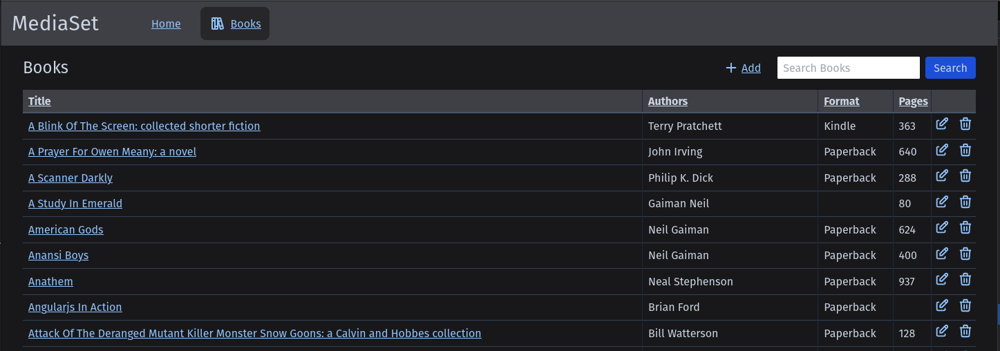
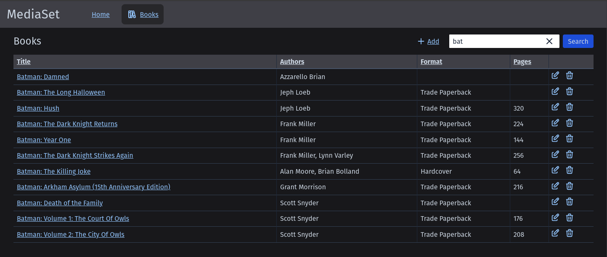
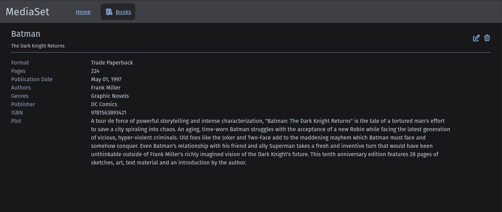

## MediaSet Library Management

### Screenshots of application
Home screen:


Books home screen:



Books home screen filtered:



Books home screen mobile friendly:


Books detail page:



## Development

### 🐳 Containerized Development (Recommended)

**New developers don't need to install .NET, Node.js, or MongoDB!** Everything runs in Docker containers with full hot-reload support.

#### Quick Start
```bash
# Clone the repository
git clone https://github.com/paulmfischer/MediaSet.git
cd MediaSet

# Start the development environment
./dev.sh start

# Access the applications:
# Frontend: http://localhost:3000
# API: http://localhost:5000 
# MongoDB: mongodb://localhost:27017
```

For complete setup instructions, debugging, and troubleshooting, see **[DEVELOPMENT.md](DEVELOPMENT.md)**.

### 📖 Traditional Development

If you prefer to install dependencies locally:

**Prerequisites:**
- .NET 8.0 SDK
- Node.js 20+
- MongoDB

**Setup:**
1. Start MongoDB locally
2. Start the API: Press `F5` in VS Code or `dotnet run` in `MediaSet.Api/`
3. Start the frontend: `npm run dev` in `MediaSet.Remix/`
4. Access: Frontend at http://localhost:3000, API at http://localhost:5000