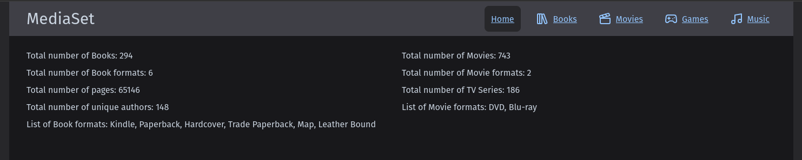
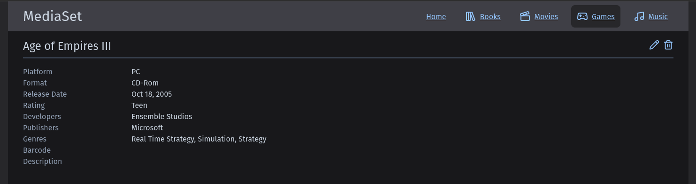

# MediaSet

A modern, full-stack personal media library management system for organizing your books, movies, and games collection. Built with .NET 9.0 and Remix.js, MediaSet provides an intuitive interface for cataloging, searching, and tracking your media items with automatic metadata lookup capabilities.

## ✨ Key Features

- **📚 Multi-Media Support**: Manage books, movies, and games in one unified application
- **🔍 Smart Metadata Lookup**: Automatic metadata retrieval using ISBN, UPC/EAN barcodes
- **📱 Responsive Design**: Mobile-friendly interface built with Tailwind CSS
- **🚀 Modern Stack**: .NET 9.0 backend API with Remix.js frontend
- **🐳 Containerized Development**: Full Docker/Podman support with hot-reload
- **⚡ Performance Optimized**: In-memory caching for fast queries
- **📊 Library Statistics**: Track collection size, authors, genres, and more

## 📸 Screenshots

### Home Dashboard
View your complete library overview with statistics and recent additions.



### Entity List
Browse and manage your media collection.


### Filtered View
Filter your collection to find specific items.


### Detailed Item View
View complete metadata, add notes, and track status.



### Edit Items
Update and manage item information with inline metadata lookup.


## 🔧 Core Features

### Metadata Lookup

MediaSet includes built-in metadata lookup functionality to quickly populate item details using various APIs:

**Books:**
- **ISBN Lookup**: Search by ISBN to automatically retrieve book metadata from OpenLibrary
- Supports multiple identifier types: ISBN, LCCN, OCLC, OLID, UPC, EAN
- Auto-populates title, authors, publisher, publication date, genres, page count, and more
- Inline lookup button in add/edit forms - results populate the form for review before saving

**Movies:**
- **Barcode Lookup**: Scan or enter UPC/EAN barcodes to retrieve movie metadata
- Two-stage lookup: UPCitemdb for product identification → TMDB for comprehensive movie data
- Auto-populates title, genres, studios, release date, rating, runtime, and plot
- Inline lookup button in add/edit forms

**Games:**
- **Barcode Lookup**: Scan or enter UPC/EAN barcodes to retrieve game metadata
- Two-stage lookup: UPCitemdb for product identification → GiantBomb for comprehensive game data
- Auto-populates title, platform, genres, developers, publishers, release date, rating, description, and format
- Inline lookup button in add/edit forms

**Configuration:**
- **UPCitemdb**: Free tier (100 requests/day) - no API key required
- **TMDB**: Free API key required - [sign up here](https://www.themoviedb.org/signup)
  - Add your TMDB Bearer Token to `appsettings.Development.json`:
    ```json
    "TmdbConfiguration": {
      "BaseUrl": "https://api.themoviedb.org/3/",
      "BearerToken": "your-tmdb-bearer-token-here",
      "Timeout": 10
    }
    ```
- **OpenLibrary**: No API key required (existing feature)
- **GiantBomb**: Free API key required - request one at https://www.giantbomb.com/api/
  - Add your GiantBomb settings to `appsettings.Development.json`:
    ```json
    "GiantBombConfiguration": {
      "BaseUrl": "https://www.giantbomb.com/api/",
      "ApiKey": "your-giantbomb-api-key-here",
      "Timeout": 10
    }
    ```
  - See detailed setup in [GIANTBOMB_SETUP.md](GIANTBOMB_SETUP.md)

## 🚀 Getting Started

### Prerequisites

**Option 1: Containerized Development (Recommended)**
- Docker or Podman installed
- No other dependencies needed!

**Option 2: Local Development**
- .NET 9.0 SDK
- Node.js 20+
- MongoDB

### Quick Start with Containers

New developers don't need to install .NET, Node.js, or MongoDB! Everything runs in containers with full hot-reload support. Both Docker and Podman are supported - the setup script automatically detects your container runtime.

```bash
# Clone the repository
git clone https://github.com/paulmfischer/MediaSet.git
cd MediaSet

# Start the development environment
./dev.sh start

# Access the applications:
# Frontend: http://localhost:3000
# API: http://localhost:5000 
# MongoDB: mongodb://localhost:27017
```

**For complete setup instructions, debugging, and troubleshooting, see [DEVELOPMENT.md](DEVELOPMENT.md).**

### Traditional Local Development

If you prefer to install dependencies locally:

1. **Start MongoDB locally**
   ```bash
   # Using Docker
   docker run -d -p 27017:27017 --name mongodb mongo:latest
   ```

2. **Start the Backend API**
   ```bash
   cd MediaSet.Api
   dotnet run
   # API available at http://localhost:5000
   ```

3. **Start the Frontend**
   ```bash
   cd MediaSet.Remix
   npm install
   npm run dev
   # Frontend available at http://localhost:3000
   ```

## 📚 Documentation

- **[DEVELOPMENT.md](DEVELOPMENT.md)** - Complete development environment setup and debugging
- **[CACHING.md](CACHING.md)** - Performance optimization and caching strategy
- **[TMDB_SETUP.md](TMDB_SETUP.md)** - The Movie Database API configuration
- **[GIANTBOMB_SETUP.md](GIANTBOMB_SETUP.md)** - GiantBomb API configuration for game metadata
- **[CONTAINER_SETUP.md](CONTAINER_SETUP.md)** - Container orchestration details

## 🛠️ Technology Stack

**Backend:**
- .NET 9.0 Web API
- MongoDB database
- RESTful API design

**Frontend:**
- Remix.js (React framework)
- TypeScript
- Tailwind CSS

**External APIs:**
- OpenLibrary (books metadata)
- The Movie Database (TMDB)
- GiantBomb (games metadata)
- UPCitemdb (barcode lookup)

## 📝 License

This project is licensed under the MIT License - see the [LICENSE](LICENSE) file for details.

## 🤝 Contributing

Contributions are welcome! Please follow the project's code style guidelines:
- Backend: [code-style-api.md](.github/code-style-api.md)
- Frontend: [code-style-ui.md](.github/code-style-ui.md)

**Important:** Always create a feature branch - never commit directly to `main`. See [.github/copilot-instructions.md](.github/copilot-instructions.md) for complete workflow guidelines.


