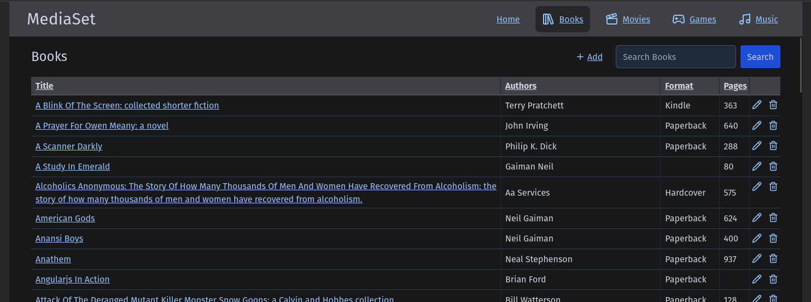

# MediaSet

A modern, full-stack personal media library management system for organizing your books, movies, and games collection. Built with .NET 9.0 and Remix.js, MediaSet provides an intuitive interface for cataloging, searching, and tracking your media items with automatic metadata lookup capabilities.

## ✨ Key Features

- **📚 Multi-Media Support**: Manage books, movies, games, and music in one unified application
- **🔍 Smart Metadata Lookup**: Automatic metadata retrieval using ISBN, UPC/EAN barcodes
- **📱 Responsive Design**: Mobile-friendly interface built with Tailwind CSS
- **🚀 Modern Stack**: .NET 9.0 backend API with Remix.js frontend
- **🐳 Containerized Development**: Full Docker/Podman support with hot-reload
- **⚡ Performance Optimized**: In-memory caching for fast queries
- **📊 Library Statistics**: Track collection size, authors, genres, and more

## 📸 Screenshots

### Home Dashboard
View your complete library overview with statistics and recent additions.


### Entity List
Browse and manage your media collection.



### Filtered View
Filter your collection to find specific items.


### Detailed Item View
View complete metadata, add notes, and track status.


### Edit Items
Update and manage item information with inline metadata lookup.


## 🔧 Core Features

### Metadata Lookup

MediaSet includes built-in metadata lookup functionality to quickly populate item details using various APIs:

**Books:**
- **ISBN Lookup**: Search by ISBN to automatically retrieve book metadata from OpenLibrary
- Supports multiple identifier types: ISBN, LCCN, OCLC, OLID, UPC, EAN
- Auto-populates title, authors, publisher, publication date, genres, page count, and more
- Inline lookup button in add/edit forms - results populate the form for review before saving

**Movies:**
- **Barcode Lookup**: Scan or enter UPC/EAN barcodes to retrieve movie metadata
- Two-stage lookup: UPCitemdb for product identification → TMDB for comprehensive movie data
- Auto-populates title, genres, studios, release date, rating, runtime, and plot
- Inline lookup button in add/edit forms

**Games:**
- **Barcode Lookup**: Scan or enter UPC/EAN barcodes to retrieve game metadata
- Two-stage lookup: UPCitemdb for product identification → GiantBomb for comprehensive game data
- Auto-populates title, platform, genres, developers, publishers, release date, rating, description, and format
- Inline lookup button in add/edit forms

**Music:**
- **Barcode Lookup**: Scan or enter UPC/EAN barcodes to retrieve music album metadata
- Direct lookup via MusicBrainz API for comprehensive album information
- Auto-populates title, artist, release date, genres, label, track count, track list with durations, and format
- Inline lookup button in add/edit forms

**Configuration:**
- **UPCitemdb**: Free tier (100 requests/day) - no API key required
- **TMDB**: Free API key required - [sign up here](https://www.themoviedb.org/signup)
  - Add your TMDB Bearer Token to `appsettings.Development.json`:
    ```json
    "TmdbConfiguration": {
      "BaseUrl": "https://api.themoviedb.org/3/",
      "BearerToken": "your-tmdb-bearer-token-here",
      "Timeout": 10
    }
    ```
- **OpenLibrary**: No API key required (existing feature)
- **GiantBomb**: Free API key required - request one at https://www.giantbomb.com/api/
  - Add your GiantBomb settings to `appsettings.Development.json`:
    ```json
    "GiantBombConfiguration": {
      "BaseUrl": "https://www.giantbomb.com/api/",
      "ApiKey": "your-giantbomb-api-key-here",
      "Timeout": 10
    }
    ```
  - See detailed setup in [GIANTBOMB_SETUP.md](GIANTBOMB_SETUP.md)
- **MusicBrainz**: No API key required (free and open)
  - Requires descriptive User-Agent header (already configured)
  - Respects 1 request per second rate limit
  - See detailed setup in [MUSICBRAINZ_SETUP.md](MUSICBRAINZ_SETUP.md)

## 🚀 Getting Started

### Prerequisites

**Option 1: Containerized Development (Recommended)**
- Docker or Podman installed
- No other dependencies needed!

**Option 2: Local Development**
- .NET 9.0 SDK
- Node.js 20+
- MongoDB

### Quick Start with Containers

New developers don't need to install .NET, Node.js, or MongoDB! Everything runs in containers with full hot-reload support. Both Docker and Podman are supported - the setup script automatically detects your container runtime.

```bash
# Clone the repository
git clone https://github.com/paulmfischer/MediaSet.git
cd MediaSet

# Start the development environment
./dev.sh start

# Access the applications:
# Frontend: http://localhost:3000
# API: http://localhost:5000 
# MongoDB: mongodb://localhost:27017
```

**For complete setup instructions, debugging, and troubleshooting, see [Development/DEVELOPMENT.md](Development/DEVELOPMENT.md).**

### Running from Pre-built Docker Images

MediaSet publishes production-ready Docker images to GitHub Container Registry. This is the easiest way to run MediaSet without building from source.

```bash
# Clone the repository (only needed for docker-compose.prod.yml)
git clone https://github.com/paulmfischer/MediaSet.git
cd MediaSet

# Pull and run the latest images
docker compose -f docker-compose.prod.yml up -d

# Or with Podman
podman-compose -f docker-compose.prod.yml up -d

# Access the applications:
# Frontend: http://localhost:3000
# API: http://localhost:8080
# MongoDB: mongodb://localhost:27017
```

**Available Images:**
- `ghcr.io/paulmfischer/mediaset-api` - Backend API
- `ghcr.io/paulmfischer/mediaset-ui` - Frontend UI

**Available Tags:**
- `latest` - Most recent stable release
- `edge` - Latest build from main branch (bleeding edge)
- `v0.x.y` - Specific version (e.g., `v0.1.0`)
- `0.x`, `0` - Major/minor version pins
- `sha-xxxxxxx` - Specific commit builds

**Example with specific version:**
```bash
# Edit docker-compose.prod.yml to specify version:
# api:
#   image: ghcr.io/paulmfischer/mediaset-api:v0.1.0
# ui:
#   image: ghcr.io/paulmfischer/mediaset-ui:v0.1.0

docker compose -f docker-compose.prod.yml up -d
```

**Configuration:**
You can customize environment variables in `docker-compose.prod.yml`:
- API configuration (MongoDB connection, TMDB/GiantBomb API keys, etc.)
- UI configuration (API base URL)
- MongoDB settings

### Traditional Local Development

If you prefer to install dependencies locally:

1. **Start MongoDB locally**
   ```bash
   # Using Docker
   docker run -d -p 27017:27017 --name mongodb mongo:latest
   ```

2. **Start the Backend API**
   ```bash
   cd MediaSet.Api
   dotnet run
   # API available at http://localhost:5000
   ```

3. **Start the Frontend**
   ```bash
   cd MediaSet.Remix
   npm install
   npm run dev
   # Frontend available at http://localhost:3000
   ```

## 📚 Documentation

- **[Development/DEVELOPMENT.md](Development/DEVELOPMENT.md)** - Complete development environment setup and debugging
- **[Development/CACHING.md](Development/CACHING.md)** - Performance optimization and caching strategy
- **[Setup/TMDB_SETUP.md](Setup/TMDB_SETUP.md)** - The Movie Database API configuration
- **[Setup/GIANTBOMB_SETUP.md](Setup/GIANTBOMB_SETUP.md)** - GiantBomb API configuration for game metadata
- **[Setup/CONTAINER_SETUP.md](Setup/CONTAINER_SETUP.md)** - Container orchestration details

## 🔖 Versioning

**Current Version:** See the [latest release](https://github.com/paulmfischer/MediaSet/releases/latest)

MediaSet follows [Semantic Versioning](https://semver.org/) (SemVer):
- **MAJOR** version for incompatible API changes
- **MINOR** version for new functionality in a backwards compatible manner
- **PATCH** version for backwards compatible bug fixes

### Pre-1.0 Development

We are currently in pre-1.0 development (v0.x.x), which means:
- The API may change without notice
- Features are being actively developed and refined
- Breaking changes may occur in minor versions
- Production use is not recommended until v1.0.0

### Version Information

Version information is available in multiple places:
- **API Health Endpoint**: `GET /health` returns version, commit SHA, and build time
- **UI Footer**: Version is displayed in the footer of all pages
- **GitHub Releases**: Full changelog and version history

### Release Process

Releases are automated using [Release Please](https://github.com/google-github-actions/release-please):
1. Commits to `main` trigger version calculation based on [Conventional Commits](https://www.conventionalcommits.org/)
2. A release PR is automatically opened/updated with the next version and changelog
3. Merging the release PR creates a Git tag and GitHub Release

### Conventional Commits

All commits must follow the Conventional Commits specification:

```
type(scope): description

[optional body]

[optional footer]
```

**Types:**
- `feat`: New feature (triggers MINOR version bump)
- `fix`: Bug fix (triggers PATCH version bump)
- `docs`: Documentation changes
- `test`: Adding or updating tests
- `refactor`: Code refactoring without feature changes
- `chore`: Maintenance tasks, dependency updates
- `style`: Code style changes (formatting, semicolons, etc.)
- `perf`: Performance improvements
- `ci`: CI/CD configuration changes
- `build`: Build system changes

**Breaking Changes:** Add `!` after type or include `BREAKING CHANGE:` in footer (triggers MAJOR version bump)

**Examples:**
```bash
feat(api): add barcode lookup for movies
fix(ui): correct form validation on book edit page
docs: update README with versioning policy
feat(api)!: change health endpoint response format
```

## 🛠️ Technology Stack

**Backend:**
- .NET 9.0 Web API
- MongoDB database
- RESTful API design

**Frontend:**
- Remix.js (React framework)
- TypeScript
- Tailwind CSS

**External APIs:**
- OpenLibrary (books metadata)
- The Movie Database (TMDB)
- GiantBomb (games metadata)
- UPCitemdb (barcode lookup)

## 📝 License

This project is licensed under the MIT License - see the [LICENSE](LICENSE) file for details.

## 🤝 Contributing

Contributions are welcome! Please follow the project's code style guidelines:
- Backend: [code-style-api.md](.github/code-style-api.md)
- Frontend: [code-style-ui.md](.github/code-style-ui.md)

**Important:** Always create a feature branch - never commit directly to `main`. See [.github/copilot-instructions.md](.github/copilot-instructions.md) for complete workflow guidelines.


