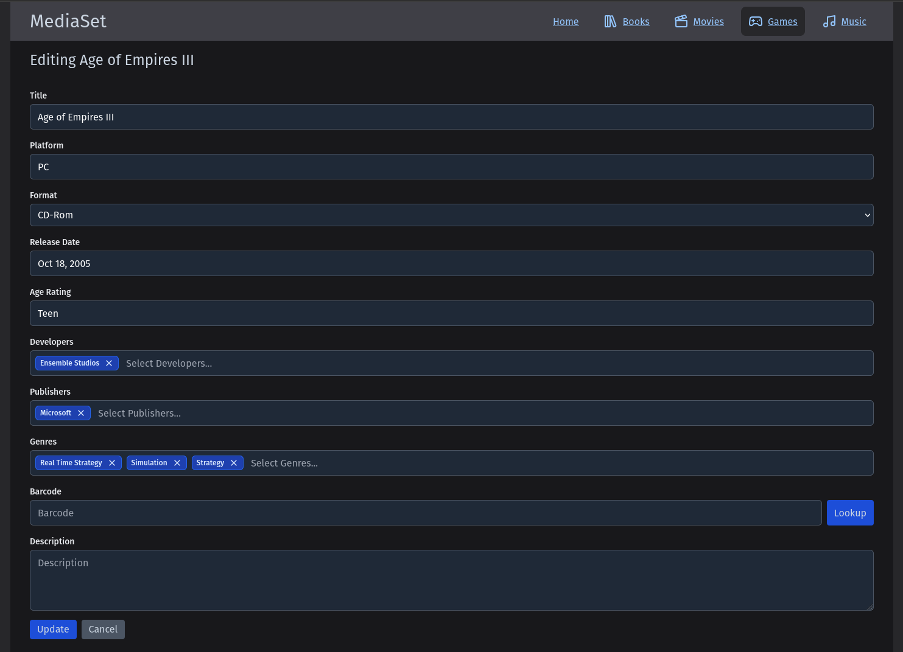

# MediaSet


A modern, full-stack personal media library management system for organizing your books, movies, and games collection. Built with .NET 10.0 and Remix.js, MediaSet provides an intuitive interface for cataloging, searching, and tracking your media items with automatic metadata lookup capabilities.

## ✨ Key Features

- **📚 Multi-Media Support**: Manage books, movies, games, and music in one unified application
- **🔍 Smart Metadata Lookup**: Automatic metadata retrieval using ISBN, UPC/EAN barcodes
- **🖼️ Cover Images**: Upload cover art, download images from lookup results, or provide URLs for automatic download
- **📱 Responsive Design**: Mobile-friendly interface built with Tailwind CSS
- **🚀 Modern Stack**: .NET 10.0 backend API with Remix.js frontend
- **🐳 Containerized Development**: Full Docker/Podman support with hot-reload
- **⚡ Performance Optimized**: In-memory caching for fast queries
- **📊 Library Statistics**: Track collection size, authors, genres, and more

## 📸 Screenshots

### Home Dashboard
View your complete library overview with statistics.


### Entity List
Browse and manage your media collection.


### Filtered View
Filter your collection to find specific items.


### Detailed Item View
View detailed metadata.


### Edit Items
Update and manage item information with inline metadata lookup.



## 🔧 Core Features

### Media Cataloging

MediaSet provides a comprehensive system for cataloging your personal media collection:

- **Multi-Media Support**: Organize books, movies, games, and music in one unified application
- **Rich Metadata**: Track detailed information including titles, authors/directors, release dates, genres, ratings, and more

### Automatic Metadata Lookup

MediaSet includes built-in metadata lookup functionality to quickly populate item details from external APIs:

**Books:**
- **ISBN Lookup**: Search by ISBN to automatically retrieve book metadata from OpenLibrary
- Supports multiple identifier types: ISBN, LCCN, OCLC, OLID, UPC, EAN
- Auto-populates title, authors, publisher, publication date, genres, page count, and more

**Movies:**
- **Barcode Lookup**: Scan or enter UPC/EAN barcodes to retrieve movie metadata
- Two-stage lookup: UPCitemdb for product identification → TMDB for comprehensive movie data
- Auto-populates title, genres, studios, release date, rating, runtime, and plot

**Games:**
- **Barcode Lookup**: Scan or enter UPC/EAN barcodes to retrieve game metadata
- Two-stage lookup: UPCitemdb for product identification → IGDB for comprehensive game data
- Auto-populates title, platform, genres, developers, publishers, release date, rating, description, and format

**Music:**
- **Barcode Lookup**: Scan or enter UPC/EAN barcodes to retrieve music album metadata
- Direct lookup via MusicBrainz API for comprehensive album information
- Auto-populates title, artist, release date, genres, label, track count, track list with durations, and format


### Cover Image Management

MediaSet allows you to manage cover images for all your media items. Images are stored locally on the filesystem and referenced in your media database, providing fast access without storing large files in MongoDB.

**Adding Cover Images:**

You can add cover images when creating or editing media items in three ways:

1. **Upload Image File**
   - Click the "Upload Image" button in the add/edit form
   - Supported formats: JPEG, PNG
   - Maximum file size: 5MB (configurable)
   - Images are automatically validated and optimized

2. **Provide Image URL**
   - Enter a URL to a cover image in the image URL field
   - The backend automatically downloads and validates the image
   - Useful for quickly grabbing images from online sources

3. **Use Lookup Result Images**
   - When performing barcode lookups (ISBN, UPC, EAN), the results often include cover image URLs
   - These URLs are displayed in the add/edit form

**Image Storage:**

Images are stored in a configurable location with Docker/Podman - either inside the container or in an externally mounted folder for persistence across container rebuilds.

## 🚀 Setup

### Prerequisites

- Docker or Podman installed

### Running MediaSet with Docker/Podman

MediaSet publishes production-ready container images to GitHub Container Registry. This is the easiest way to run MediaSet.

**Step 1: Create a docker-compose.yml file**

Create a `docker-compose.yml` file using the [example production configuration](https://github.com/paulmfischer/MediaSet/blob/main/docker-compose.prod.yml) as a template:

```yaml
version: '3.8'

services:
  mediaset-api:
    image: ghcr.io/paulmfischer/mediaset-api:latest
    container_name: mediaset-api
    restart: unless-stopped
    ports:
      - "8080:8080"
    environment:
      ASPNETCORE_URLS: "http://+:8080"
      ASPNETCORE_ENVIRONMENT: "Production"
      MediaSetDatabaseSettings__ConnectionString: "mongodb://mongo:27017"
      MediaSetDatabaseSettings__DatabaseName: "MediaSet"
      
      # Optional: Configure integrations (uncomment and add your API keys)
      # OpenLibraryConfiguration__ContactEmail: "your-email@example.com"
      # TmdbConfiguration__BearerToken: "your-tmdb-bearer-token"
      # IgdbConfiguration__ClientId: "your-twitch-client-id"
      # IgdbConfiguration__ClientSecret: "your-twitch-client-secret"
      # MusicBrainzConfiguration__UserAgent: "MyApp/1.0 (contact@example.com)"
      # UpcItemDbConfiguration__ApiKey: "your-upcitemdb-api-key"
    
    volumes:
      - mediaset-images:/app/data/images
    depends_on:
      - mongo
    networks:
      - mediaset
  
  mediaset-ui:
    image: ghcr.io/paulmfischer/mediaset-ui:latest
    container_name: mediaset-ui
    restart: unless-stopped
    ports:
      - "3000:3000"
    environment:
      # Server-side API URL - for Remix server to call API (uses container name)
      apiUrl: "http://mediaset-api:8080"
      
      # Client-side API URL - for browser to access API (must be externally accessible)
      # Replace with your actual hostname/IP
      clientApiUrl: "http://[hostname]:8080"
    depends_on:
      - mediaset-api
    networks:
      - mediaset
  
  mongo:
    image: mongo:latest
    container_name: mediaset-mongo
    restart: unless-stopped
    ports:
      - "27017:27017"
    volumes:
      - mediaset-db:/data/db
    networks:
      - mediaset

volumes:
  mediaset-db:
  mediaset-images:

networks:
  mediaset:
```

**Step 2: Start the services**

```bash
# Using Docker
docker compose up -d

# Using Podman
podman-compose up -d
```

**Step 3: Access MediaSet**

- Frontend UI: http://[hostname]:3000
- Backend API: http://[hostname]:8080
- API Documentation: http://[hostname]:8080/swagger

Replace `[hostname]` with `localhost` (if running locally), your server's IP address, or domain name depending on where you're running the containers.

### Available Container Images

Images are published to GitHub Container Registry:
- `ghcr.io/paulmfischer/mediaset-api` - Backend API
- `ghcr.io/paulmfischer/mediaset-ui` - Frontend UI

**Available Tags:**
- `latest` - Most recent stable release
- `vx.y.z` - Specific version (e.g., `v2.4.0`)

### Configuration

Configuration can be provided through:
- **Environment variables** in `docker-compose.yml` (recommended)
- **`.env` file** in the same directory as `docker-compose.yml`

For detailed configuration instructions, see [Setup/CONTAINER_SETUP.md](Setup/CONTAINER_SETUP.md).

### Documentation

- **[Setup/CONTAINER_SETUP.md](Setup/CONTAINER_SETUP.md)** - Container orchestration and configuration details
- **[Setup/OPENLIBRARY_SETUP.md](Setup/OPENLIBRARY_SETUP.md)** - OpenLibrary API configuration for book metadata
- **[Setup/TMDB_SETUP.md](Setup/TMDB_SETUP.md)** - The Movie Database API configuration
- **[Setup/IGDB_SETUP.md](Setup/IGDB_SETUP.md)** - IGDB API configuration for game metadata
- **[Setup/MUSICBRAINZ_SETUP.md](Setup/MUSICBRAINZ_SETUP.md)** - MusicBrainz API configuration for music metadata
- **[Setup/UPCITEMDB_SETUP.md](Setup/UPCITEMDB_SETUP.md)** - UPCItemDB API configuration for barcode lookup

## 👨‍💻 Developer Getting Started

### Prerequisites

- Docker or Podman installed (for containerized development)
- Git

### Quick Start with Development Containers

New developers don't need to install .NET, Node.js, or MongoDB locally! The development environment runs entirely in containers with full hot-reload support.

```bash
# Clone the repository
git clone https://github.com/paulmfischer/MediaSet.git
cd MediaSet

# Start the development environment
./dev.sh start

# Access the applications:
# Frontend: http://localhost:3000
# API: http://localhost:5000
# API Documentation: http://localhost:5000/swagger
# MongoDB: mongodb://localhost:27017
```

### Development Commands

The `./dev.sh` script provides convenient commands for managing the development environment:

```bash
# Start all services
./dev.sh start

# Start specific services
./dev.sh start api        # Start backend API only
./dev.sh start frontend   # Start frontend UI only

# Restart services
./dev.sh restart api      # Restart backend API
./dev.sh restart frontend # Restart frontend UI

# Stop services
./dev.sh stop             # Stop all services
./dev.sh stop api         # Stop backend API
./dev.sh stop frontend    # Stop frontend UI

# View logs
./dev.sh logs            # View all service logs
./dev.sh logs api        # View API logs only
```

### Running Tests

```bash
# Backend tests
dotnet test MediaSet.Api.Tests/MediaSet.Api.Tests.csproj

# Frontend tests
cd MediaSet.Remix && npm test

# Frontend build
cd MediaSet.Remix && npm run build
```

**For complete development setup, debugging, and troubleshooting, see [Development/DEVELOPMENT.md](Development/DEVELOPMENT.md).**

### Documentation

- **[Development/DEVELOPMENT.md](Development/DEVELOPMENT.md)** - Complete development environment setup and debugging
- **[Development/TESTING.md](Development/TESTING.md)** - Testing guidelines and strategies
- **[Development/CACHING.md](Development/CACHING.md)** - Performance optimization and caching strategy

## 🔖 Versioning

**Current Version:** See the [latest release](https://github.com/paulmfischer/MediaSet/releases/latest)

MediaSet follows [Semantic Versioning](https://semver.org/) (SemVer):
- **MAJOR** version for incompatible API changes
- **MINOR** version for new functionality in a backwards compatible manner
- **PATCH** version for backwards compatible bug fixes

### Version Information

Version information is available in multiple places:
- **API Health Endpoint**: `GET /health` returns version, commit SHA, and build time
- **UI Footer**: Version is displayed in the footer of all pages
- **GitHub Releases**: Full changelog and version history

### Release Process

Releases are automated using [Release Please](https://github.com/google-github-actions/release-please):
1. Commits to `main` trigger version calculation based on [Conventional Commits](https://www.conventionalcommits.org/)
2. A release PR is automatically opened/updated with the next version and changelog
3. Merging the release PR creates a Git tag and GitHub Release

### Conventional Commits

All commits must follow the Conventional Commits specification:

```
type(scope): description

[optional body]

[optional footer]
```

**Types:**
- `feat`: New feature (triggers MINOR version bump)
- `fix`: Bug fix (triggers PATCH version bump)
- `docs`: Documentation changes
- `test`: Adding or updating tests
- `refactor`: Code refactoring without feature changes
- `chore`: Maintenance tasks, dependency updates
- `style`: Code style changes (formatting, semicolons, etc.)
- `perf`: Performance improvements
- `ci`: CI/CD configuration changes
- `build`: Build system changes

**Breaking Changes:** Add `!` after type or include `BREAKING CHANGE:` in footer (triggers MAJOR version bump)

**Examples:**
```bash
feat(api): add barcode lookup for movies
fix(ui): correct form validation on book edit page
docs: update README with versioning policy
feat(api)!: change health endpoint response format
```

## 🏗️ Tech Stack

**Backend:**
- .NET 10.0 Web API
- MongoDB database
- RESTful API design

**Frontend:**
- Remix.js (React framework)
- TypeScript
- Tailwind CSS

**External APIs:**
- OpenLibrary (books metadata)
- The Movie Database (TMDB)
- IGDB (games metadata)
- MusicBrainz (music metadata)
- UPCitemdb (barcode lookup)

## 📝 License

This project is licensed under the Apache License 2.0. See the [LICENSE](LICENSE) file for details.
